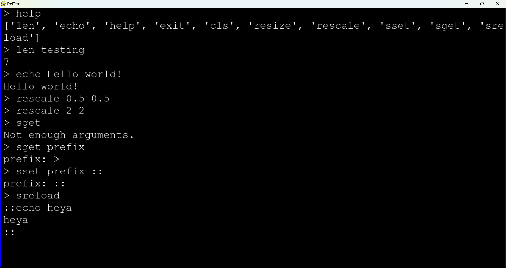

# DelTerm

DelTerm is a simple terminal emulator implemented in Python.



## Table of Contents
- [Introduction](#introduction)
- [Features](#features)
- [Installation](#installation)
- [Usage](#usage)
- [Contributing](#contributing)
- [License](#license)

## Introduction

DelTerm is a lightweight terminal emulator designed to provide basic functionalities and is made with extensibility in mind, enabling users to create modules. It is implemented in Python using standard libraries and pygame, making it easy to understand and extend.

## Features:
- Basic command execution

## Planned Features:
- Support for common command-line utilities
- Enable the user to create, delete and move windows
- Support for extensions: screens, programs and themes

## Installation

1. Clone the repository:
    ```bash
    git clone https://github.com/D4N1L0200/DelTerm.git
    ```
2. Navigate to the project directory:
    ```bash
    cd DelTerm
    ```
3. Install dependencies:
    ```bash
    pip install -r requirements.txt
    ```
4. Run the terminal emulator:
    ```bash
    python src/main.py
    ```
   
## Usage

Terminal provides a simple command-line interface for executing commands. Use the 'help' command to see every available command. Bellow are some basic commands to get you started:

### Misc:
- 'len': Counts the amount of characters in the message.
- 'echo': Replies with the same message.
- 'help': Shows a list of available commands.
- 'exit': Exits the app.

### Terminal:
- 'cls': Clear the terminal screen.
- 'resize': Resizes terminal screen to pixel resolution.
- 'rescale': Rescales terminal screen to relative scale.
- 'sset': Sets a value for the terminal config.
- 'sget': Gets a value from the terminal config.
- 'sreload': Reloads all saved values from the terminal config.

## Contributing

Contributions to DelTerm are welcome! You can contribute to the project by:

- Reporting bugs or suggesting new features by creating an issue.
- Forking the repository and submitting a pull request with your changes.

For more information on contributing, please refer to the [CONTRIBUTING.md](CONTRIBUTING.md) file.

## License

This project is licensed under the [MIT License](LICENSE). See the LICENSE file for details.

