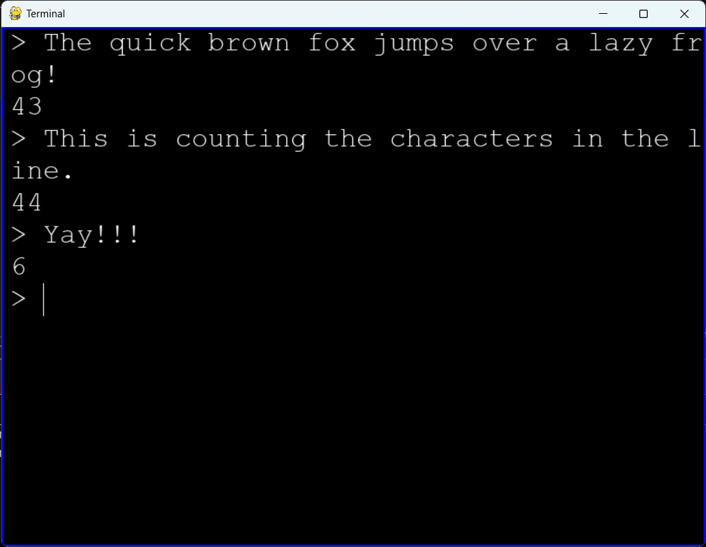

# DelTerm

DelTerm is a simple terminal emulator implemented in Python.



## Table of Contents
- [Introduction](#introduction)
- [Features](#features)
- [Installation](#installation)
- [Usage](#usage)
- [Contributing](#contributing)
- [License](#license)

## Introduction

DelTerm is a lightweight terminal emulator designed to provide basic functionalities for interacting with the command line, although it currently only counts the characters in the input. It is implemented in Python using standard libraries and pygame, making it easy to understand and extend.

## Planned Features:
- Basic command execution
- Support for common command-line utilities
- Enable the user to create, delete and move windows
- Support for extensions: screens, programs and themes

## Installation

1. Clone the repository:
    ```bash
    git clone https://github.com/D4N1L0200/DelTerm.git
    ```
2. Navigate to the project directory:
    ```bash
    cd DelTerm/src
    ```
3. Run the terminal emulator:
    ```bash
    python main.py
    ```

## Contributing

Contributions to DelTerm are welcome! You can contribute to the project by:

- Reporting bugs or suggesting new features by creating an issue.
- Forking the repository and submitting a pull request with your changes.

For more information on contributing, please refer to the [CONTRIBUTING.md](CONTRIBUTING.md) file.

## License

This project is licensed under the [MIT License](LICENSE). See the LICENSE file for details.
